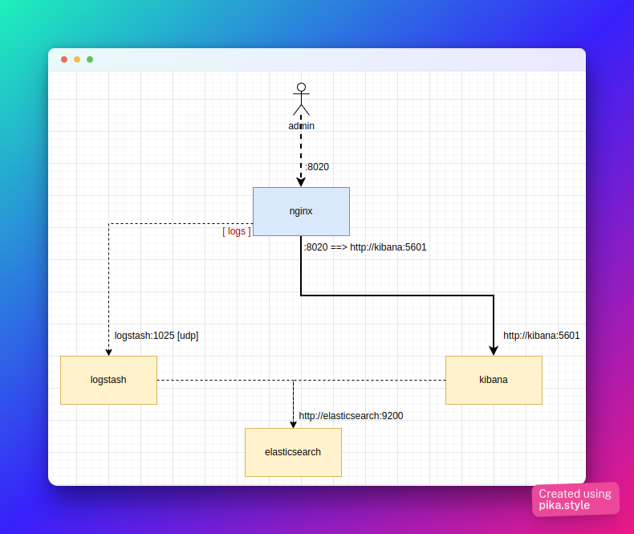
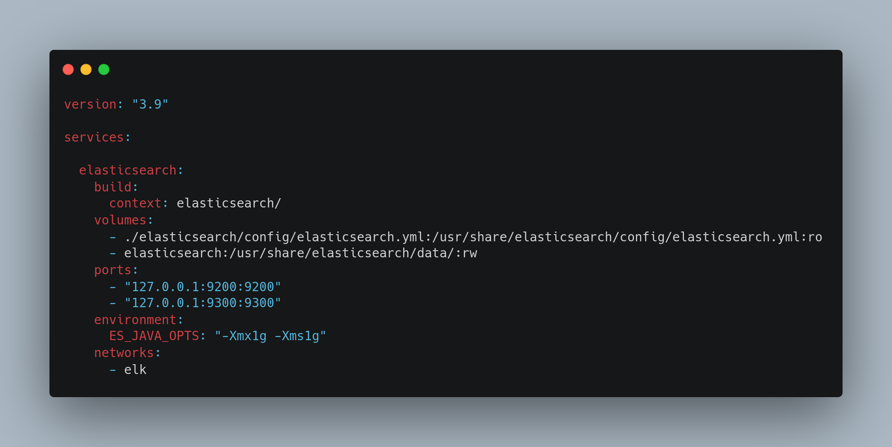
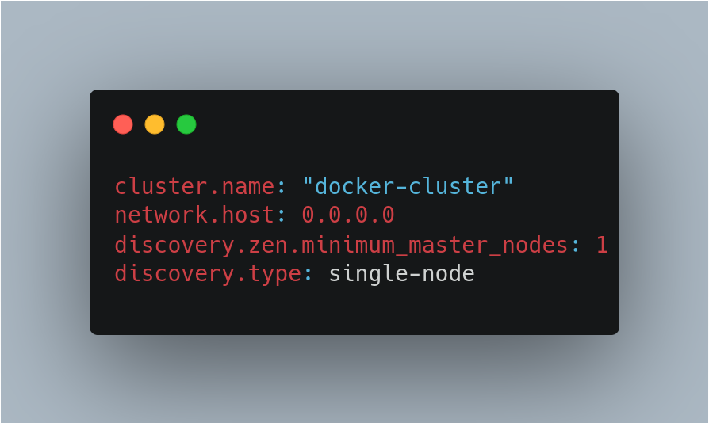

# Monitoring Nginx logs with ELK stack. All running at Docker.
This small project contains all you need to run a **docker compose up** and have a Nginx ready monitored by a ELK stack. 
It allows you to analyse any log data sent by nginx to Elastic Search using the visualization tools of Kibana.
You dont need read anything to run the project, only **docker compose up** is enough. 
But here I'll show you the key points of solution if you need understand each item.

Below you see the project diagram.

- User admin can access kibana by port locahost:8020. Nginx will redirect from 9020 to kibana port 5601.
- Nginx will send logs to logstabh by udp at port 1025.

## Elastic Search

The key points of Elastic Search configuration here are:
- "build/context" set the Elastic Dockerfile directory path.
- "volumes" maps the elastic.yml (to configure Elastic Search) and an writable directory to "data". 
- "ports" maps port 9200 (API Elastic default port). Also maps 9300 but it is only used for clusterization.
- "enviroments/ES_JAVA_OPTS" contains JVM flags to incresate memory size.
- "network" indicates the private network which all components to comunicate each other.

