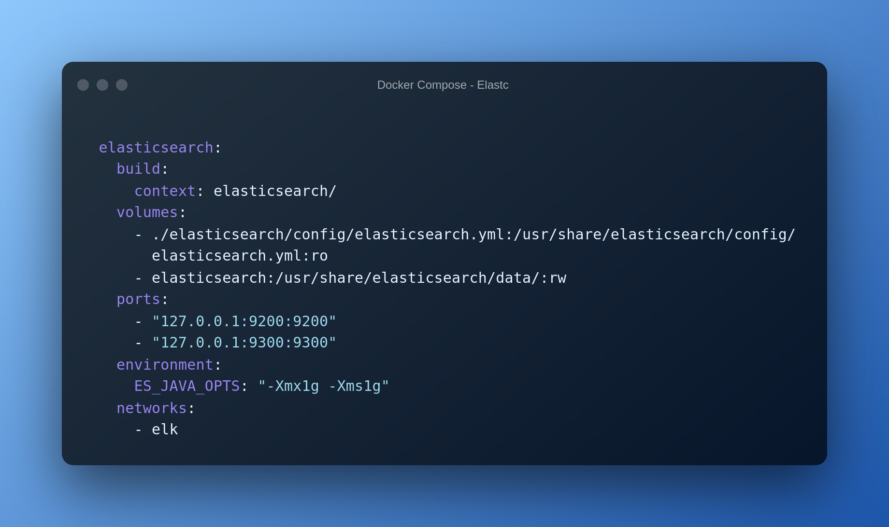

# elk-nginx-docker
Run a Nginx reverse proxy integrated with ELK stack all running with Docker and Docker Compose. 

It allows you to analyse any log data sent by nginx to Elastic Search using the visualization tools of Kibana.

The diagram below shows all components in this example.

- User admin can access kibana by port locahost:8020. Nginx will redirect from 9020 to kibana port 5601.
- Nginx will send logs to logstabh by udp at port 1025.

## Elastic Search

The key points of Elastic Search configuration here are:
- "build/context" set the Elastic Dockerfile path.
- "volumes" map the elastic.yml (to configure Elastic Search) and an writable directory to Elastic. 
- "ports" map the port 9200 (API Elastic default port). Also maps 9300 but it is only used by clusters.
- "enviroments/ES_JAVA_OPTS" contains JVM flags to incresate memory size.
- "network" indicate the private network where all components will to comunicate each other.