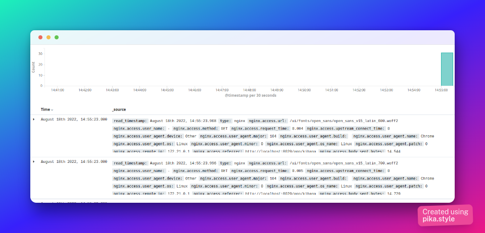

# elk-nginx-docker
Run a Nginx reverse proxy integrated with ELK stack all running with Docker and Docker Compose. 

It allows you to analyse any log data sent by nginx using the visualization tools of Kibana.

The diagram below shows all components in this example. Next, we will detail each one.
